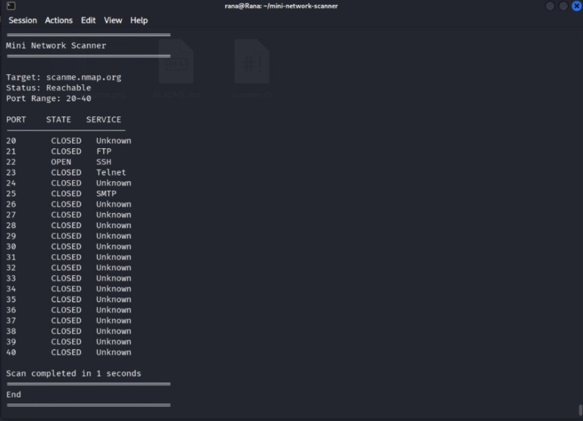
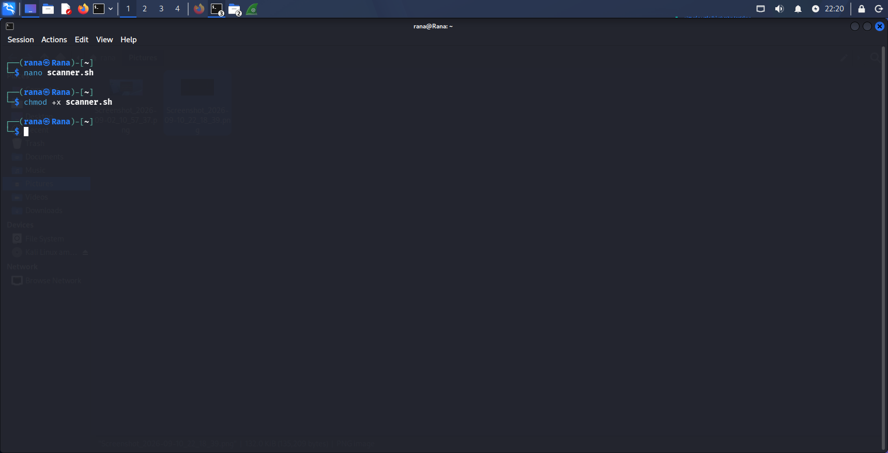

# 🛰️ Mini Network Scanner

A simplified **nmap-like** network scanner built entirely in **Bash** using `/dev/tcp` for port scanning.

---

## 📖 About

This project was built as part of my **Linux & Cybersecurity** learning journey. It performs the core functionality of `nmap` — checking target reachability, scanning port ranges, identifying services, and generating a report.

---

## ✨ Features

- 🟢 **Reachability check** using `ping` before scanning
- ⚡ **Parallel port scanning** using `/dev/tcp` and background jobs
- 🔍 **Service identification** for common ports (SSH, HTTP, FTP, MySQL, etc.)
- ✅ **Open / Closed** status for each port
- ❓ **Unknown** service label for unrecognized ports
- 📄 **Automated report** saved to `Reports/scan_<target>.txt`
- ⏱️ **Scan duration** measurement (start time vs end time)

---

## 🛠️ Tools & Concepts Used

| Category | Tools / Concepts |
|----------|------------------|
| Input / Output | `read`, `echo`, `printf` |
| Network | `ping -c 1`, `/dev/tcp` |
| Time | `date +%s` |
| Data Structures | `declare -A` (associative array) |
| Parallelism | Background jobs (`&`), `wait` |
| Utilities | `seq`, `timeout`, `tee`, `cut` |
| Control Flow | Loops, conditionals, command substitution |

---

## 🚀 Usage

**1. Make the script executable**

    chmod +x scanner.sh

**2. Run the script**

    ./scanner.sh

**3. Enter the required inputs**

- 🎯 **Target:** e.g. `scanme.nmap.org` or `127.0.0.1`
- 📌 **Port range:** e.g. `1-100`

---

## 📷 Screenshots

**Execution**

**chmod +x**

---

## ⚠️ Disclaimer

This tool is for **educational purposes only**.
Only scan systems you own or have explicit permission to test.

---

## 👩‍💻 Author

**Rana Elgeddawy**
[GitHub](https://github.com/ranaelgeddawy)
